# Crowd Counting with Convolutional Neural Network Model

This item is used to analyze and predict the number of people in the given image. It can be used to analyze the number of people in a mall in order to prevent overcrowding and avoid mishaps from taking place.

## Data Source

The data source for this project comes from the crowd counting data set on the kaggle website. The dataset consists of a collection of 2000 images, each image has a size of 480x640 pixels and has 3 channels. The images were collected from a still webcam that is located inside a mall. Each image has a different number of people.

- The images from the dataset:

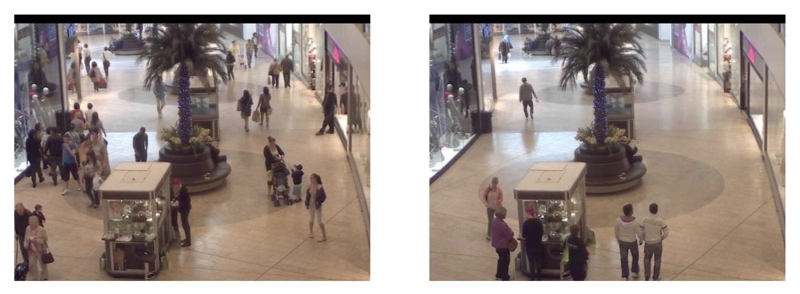

- Distribution of labels
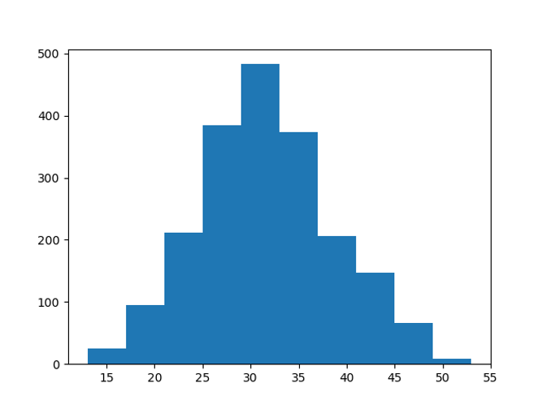

- Use the link below to visit the data source:

[crowd counting](https://www.kaggle.com/fmena14/crowd-counting)

## CNN

- Learning rate vs Loss

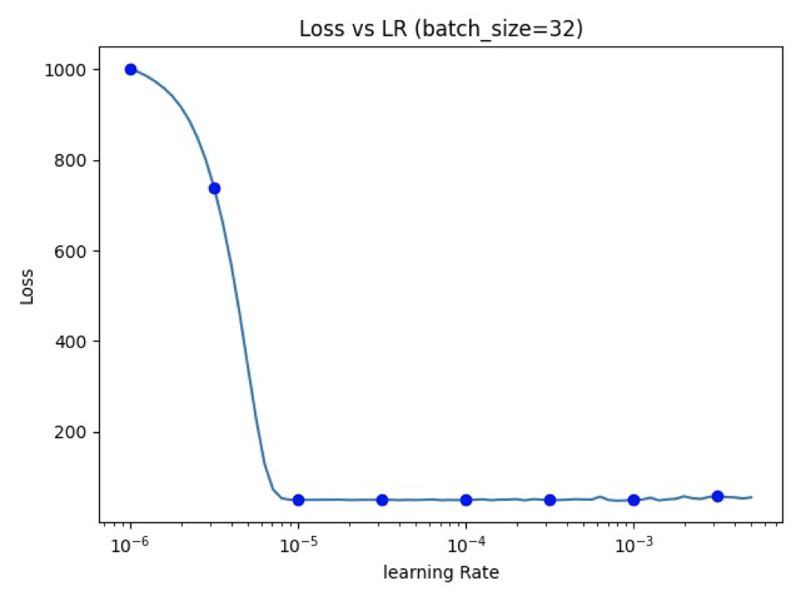   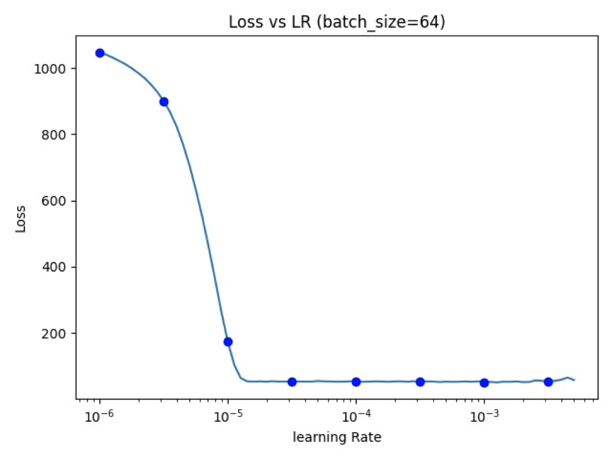   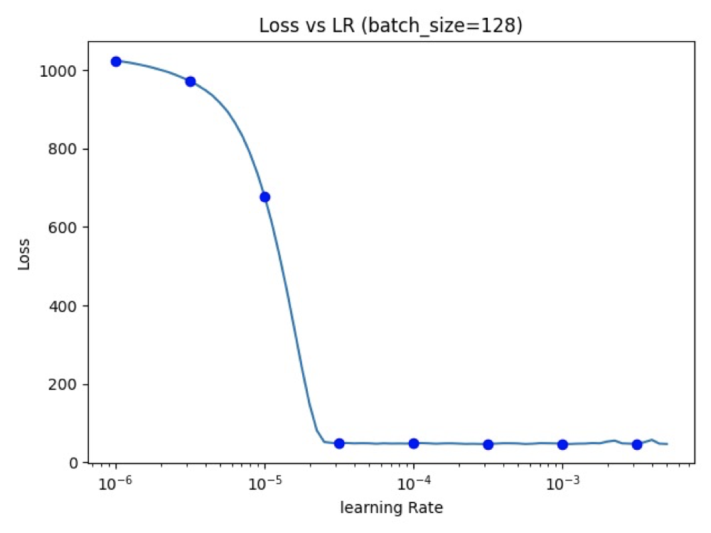

- Model parameters

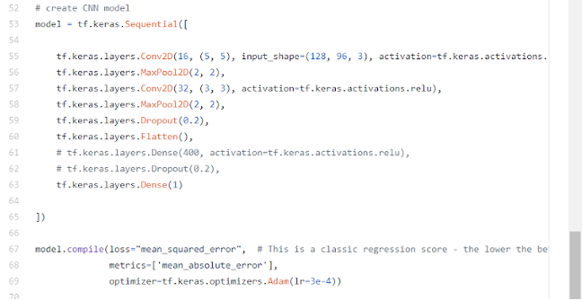

- Evaluation

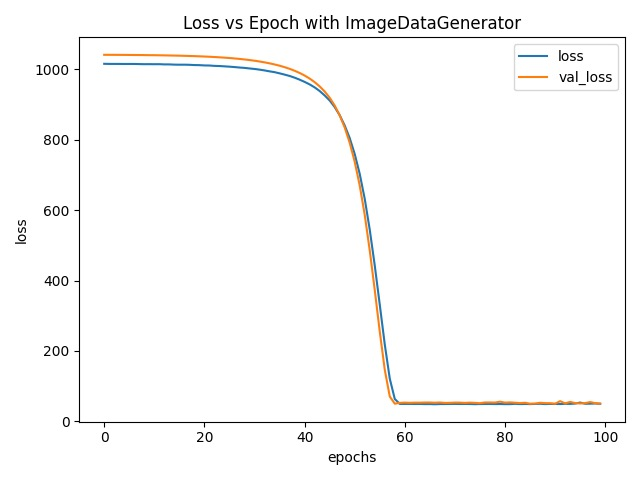
The blue line represents the performance of the model in the training data, and the orange line represents the training results of the model in the test data. It can be known that the model successfully achieved the learning function during training, and after 100 epochs, the training loss and testing loss were reduced to about 49.
 
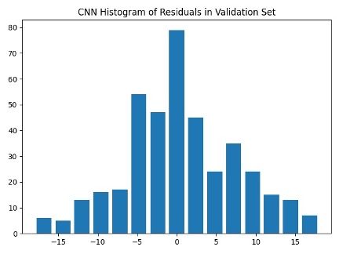
The residuals are relatively normally distributed for both models, with a mean around 0. It accurately predicts 31 images. For the remaining pictures without accurate prediction of count, the error between the value of count predicted by this model and the actual value is mostly relatively small.

## Prediction result

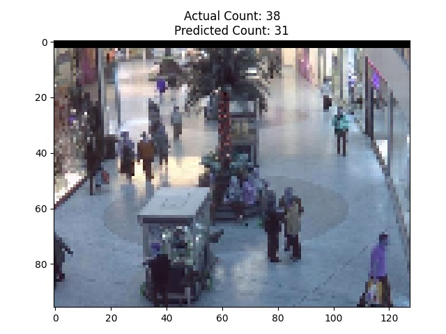  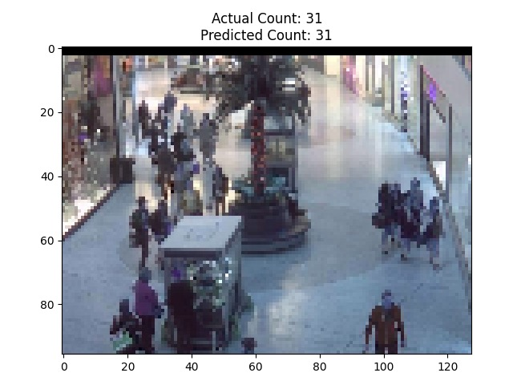
 
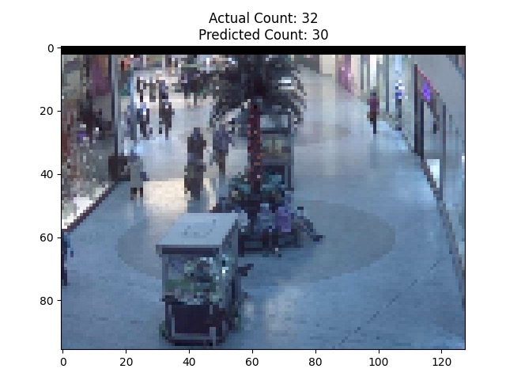  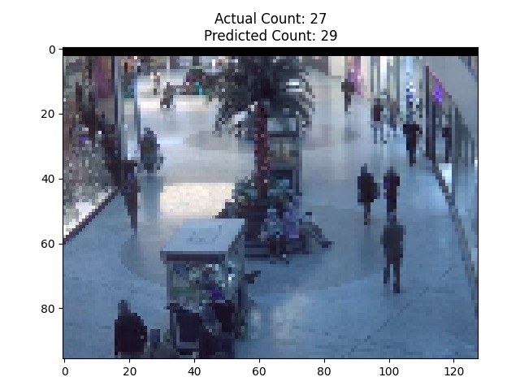

